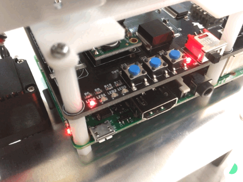

# Raspberry Pi Gibbonの動作確認

raspigibbon_standaloneを使用して動作確認を行います。

## raspigibbon_standalone概要

スタンドアロンモードではSW0/SW2を使って動作モードの切り替え、SW1で動作モード決定します。

動作モード選択時はLEDで現在の状態を2進数表示するようになっています。

### デフォルトの動作モード

* 0 : 待機
* 1 : 動作チェック1
* 2 : 動作チェック2
* 3-14 : 未設定
* 15 : プログラム終了（Raspberry Piのシャットダウンではありません）

## 操作手順
Ubuntuの起動には10秒程度時間がかかります。
起動後、LEDが順番に点灯します。
すべてのLEDが点灯後、順番に消えていきます。

すべてのLEDが消えるときにSW1（中央のスイッチ）を押した状態でいてください。

電源を入れたときからSW1（中央のスイッチ）を押し続ければ問題ありません。

操作モードに入ると以下のようにすべてのLEDが同時に点滅します。

この状態でSW1から手を離し、SW2（右側のスイッチ）を1回だけ押します。

するとLED0が点灯します。（動作モードは1です。）

この状態でSW1（中央のスイッチ、決定ボタン）を押すと、Raspberry Pi Gibbonが動き出します。

周囲にぶつかるものがないか十分に注意しながら動作確認をしてください。

これですべてのサーボが駆動すれば動作確認は完了です。

これらの流れを以下の動画で紹介しています。ご覧ください。

次は[サンプルプログラムの実行](tutorial-run-sample.html)を行います。
