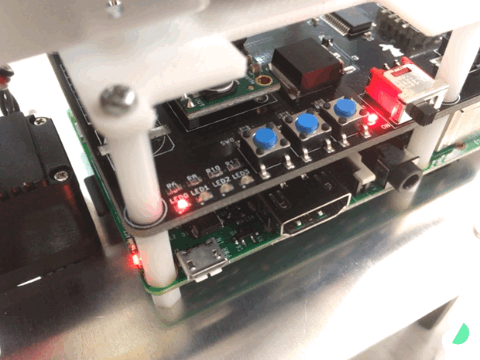

# サンプルプログラムの実行

## 実行手順
まずはsshでログインします。Raspberry Piに有線LANを接続してください。

sshコマンドが使える環境では以下のコマンドでログインできます。

```
ssh ubuntu@ubuntu.local
```

本チュートリアルに従ってmicroSDを用意した場合、[Tiryoh/raspigibbon_standalone](https://github.com/Tiryoh/raspigibbon_standalone)がホームディレクトリにすでにコピーされています。
サンプルプログラムを実行してみます。
Raspberry Pi Gibbonが動き出すので注意してください。
```
cd ~/raspigibbon_standalone/src/
./open_hand.py
```

待機姿勢にしてからサーボをオフにしてみます。Raspberry Pi Gibbonが動き出すので注意してください。
```
./hand_rest.py
```

以上でサンプルプログラムの実行ができました。


## プログラムの説明

このサンプルプログラムは[Tiryoh/RS30X](https://github.com/Tiryoh/RS30X)を使用しています。
以下のようなプログラムを書けば簡単にサーボを制御することができます。
```
#!/usr/bin/env python
# coding:utf-8

import time
from RS30X import RS304MD as RS30X

if __name__ == '__main__':
    servo = RS30X()

    for i in range(1,6):
        servo.setTorque(i, True)
        time.sleep(0.01)

    for i in range(1,6):
        servo.setAngle(i, 0)
        time.sleep(0.1)
```

先ほどの[動作確認](tutorial-operation-check-raspigibbon.html)の章で紹介した起動時のスクリプトは`~/raspigibbon_standalone/standalone.sh`です。

このスクリプトでは`~/raspigibbon_standalone/scripts`にあるスクリプトを呼び出しています。

たとえば、先ほどはLED0のみが点灯している状態、つまり2進数表示では「1」となり、動作モードは1を選択しています。 



この状態の場合は「7」です。


この状態の場合は「12」です。


 
動作モード1では`script1.sh`を、動作モード2では`script2.sh`をというようにスクリプトを呼び出しています。  
つまり、`script3.sh`を作成すれば動作モード3で作成したスクリプトを呼び出すことができますし、`script4.sh`ならば動作モード4で呼び出せます。

動かしたいスクリプトを作成して起動時に実行してみてください。
