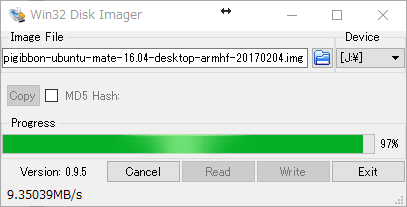

# Raspberry Piの準備

## 準備するもの

* microSDを読み書きできるPC（必要に応じてmicroSD→SDの変換アダプタなどを利用してください）
* microSD 16GB以上（Class10推奨）

## 手順

以下のOSについてそれぞれ記載しています。

* [Windows](#windows)
* [macOS/OSX](#mac)
* [Ubuntu](#ubuntu)

---

### Windows

書き込みには以下の2つのソフトウェアを使用します。

* [7zip](https://sevenzip.osdn.jp/)
* [Win32DiskImager](https://ja.osdn.net/projects/sfnet_win32diskimager/)

手順は以下の通りです。

* 公式リポジトリ([rt-net/RaspberryPiGibbon](https://github.com/rt-net/RaspberryPiGibbon))からイメージファイルのダウンロードページへアクセスします。


* ダウンロードページから最新版のイメージファイルをダウンロードします。

※ここでダウンロードできる「Source code (zip)」「Source code (tar.gz)」はUbuntuイメージのソースコードではありません。拡張子が「.img.xz」となっているファイルをダウンロードします。


* ダウンロードするファイルは1GB近くあります。ダウンロード完了まで少々時間がかかります。


* ダウンロードしたファイルを7zipを使って展開します。


* およそ8GBのイメージファイルが作成されたことを確認してください。


* Win32DiskImagerを起動します。


* 先ほど展開し作成したイメージファイルを選択してください。


* Writeをクリックして書き込みます。




* Write Successfulと表示されたら書き込み終了です。


次は[Raspberry Pi Gibbonの動作確認](tutorial-operation-check-raspigibbon.html)を行います。

---

### Mac

* 公式リポジトリ([rt-net/RaspberryPiGibbon](https://github.com/rt-net/RaspberryPiGibbon))からイメージファイルのダウンロードページへアクセスします。


* ダウンロードページから最新版のイメージファイルをダウンロードします。

※ここでダウンロードできる「Source code (zip)」「Source code (tar.gz)」はUbuntuイメージのソースコードではありません。拡張子が「.img.xz」となっているファイルをダウンロードします。


* ダウンロードするファイルは1GB近くあります。ダウンロード完了まで少々時間がかかります。


Terminal.appを起動します。
以下、Terminal.appで作業します。

まず、microSD挿入前に以下のコマンドを実行して現在認識されているディスクを確認します。
```
diskutil list
```

以下のような表示が出ると思います。
```
$ diskutil list
/dev/disk0 (internal, physical):
   #:                       TYPE NAME                    SIZE       IDENTIFIER
   0:      GUID_partition_scheme                        *500.3 GB   disk0
   1:                        EFI EFI                     209.7 MB   disk0s1
   2:          Apple_CoreStorage Macintosh HD            450.8 GB   disk0s2
   3:                 Apple_Boot Recovery HD             650.0 MB   disk0s3
   4:       Microsoft Basic Data                         48.5 GB    disk0s4
/dev/disk1 (internal, virtual):
   #:                       TYPE NAME                    SIZE       IDENTIFIER
   0:                  Apple_HFS Macintosh HD           +450.4 GB   disk1
                                 Logical Volume on disk0s2
                                 Unencrypted
```

microSDを挿入後、再び以下のコマンドを実行します。

```
diskutil list
```

disk2が増えていることが確認できました。
```
$ diskutil list
/dev/disk0 (internal, physical):
   #:                       TYPE NAME                    SIZE       IDENTIFIER
   0:      GUID_partition_scheme                        *500.3 GB   disk0
   1:                        EFI EFI                     209.7 MB   disk0s1
   2:          Apple_CoreStorage Macintosh HD            450.8 GB   disk0s2
   3:                 Apple_Boot Recovery HD             650.0 MB   disk0s3
   4:       Microsoft Basic Data                         48.5 GB    disk0s4
/dev/disk1 (internal, virtual):
   #:                       TYPE NAME                    SIZE       IDENTIFIER
   0:                  Apple_HFS Macintosh HD           +450.4 GB   disk1
                                 Logical Volume on disk0s2
                                 Unencrypted
/dev/disk2 (internal, physical):
   #:                       TYPE NAME                    SIZE       IDENTIFIER
   0:     FDisk_partition_scheme                        *15.9 GB    disk2
```

disk番号を確認後、以下のコマンドで書き込みます。

```
cd ~/Downloads
diskutil unmountDisk /dev/disk2
xzcat raspberrypigibbon-ubuntu-mate-16.04-desktop-armhf-20170204.img.xz | sudo dd of=/dev/rdisk2 bs=1m
```

書き込み終了後、ejectすれば完了です。

```
diskutil eject /dev/disk2
```

次は[Raspberry Pi Gibbonの動作確認](tutorial-operation-check-raspigibbon.html)を行います。

---

### Ubuntu

* 公式リポジトリ([rt-net/RaspberryPiGibbon](https://github.com/rt-net/RaspberryPiGibbon))からイメージファイルのダウンロードページへアクセスします。


* ダウンロードページから最新版のイメージファイルをダウンロードします。

※ここでダウンロードできる「Source code (zip)」「Source code (tar.gz)」はUbuntuイメージのソースコードではありません。拡張子が「.img.xz」となっているファイルをダウンロードします。


* ダウンロードするファイルは1GB近くあります。ダウンロード完了まで少々時間がかかります。


Terminalを起動します。
以下、Terminalで作業します。

まず、microSD挿入前に以下のコマンドを実行して現在認識されているディスクを確認します。
```
ls /dev/mmcblk*
```

以下のような表示が出ると思います。
```
$ ls /dev/mmcblk*
ls: cannot access '/dev/mmcblk*': No such file or directory
```

microSDを挿入後、再び以下のコマンドを実行します。

```
ls /dev/mmcblk*
```

`/dev/mmcblk0`が増えていることが確認できました。
```
$ ls /dev/mmcblk*
/dev/mmcblk0
```

番号を確認後、以下のコマンドで書き込みます。

```
cd ~/Downloads
xzcat raspberrypigibbon-ubuntu-mate-16.04-desktop-armhf-20170204.img.xz | sudo dd of=/dev/mmcblk0 bs=1M
```

書き込み終了後、microSDを取り外して完了です。


次は[Raspberry Pi Gibbonの動作確認](tutorial-operation-check-raspigibbon.html)を行います。
